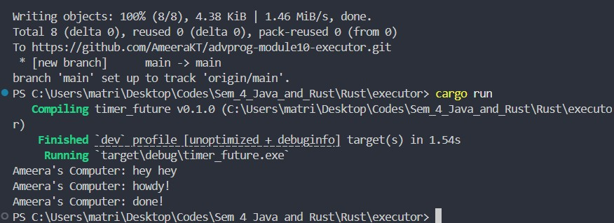
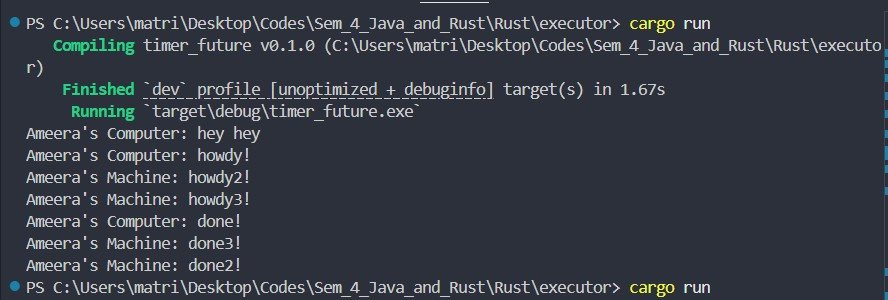
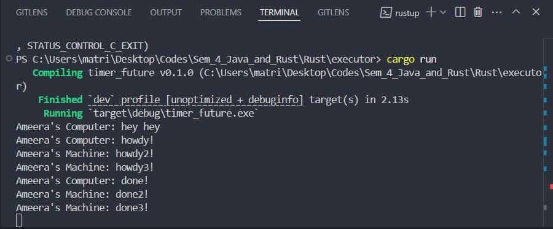

# Advanced Programming Module 10

## Asynchronous Programming - Timer and Executor

### Reflection

##### Experiment 1.2:

In the image above, heyhey is printd first before howdy! and done! because it is located outside of the asynchronous function while the latter two are inside one. The asynchronous function is calleid by a spawner which is a process that does not stop the main process while running in the background. The main function immediately goes to the next instruction given which is after the asynchronous function which is the new print function for 'hey hey', which is printed first before 'howdy!' and 'done!'.

##### Experiment 1.3:

With the drop function in the code, the program ends after printing out all the strings. The drop function lets the executor know that all operations meant to be executed by it hhave all been assigned and it can stop running.

Without drop, the program does not end. It waits for any potential operations to execute.
